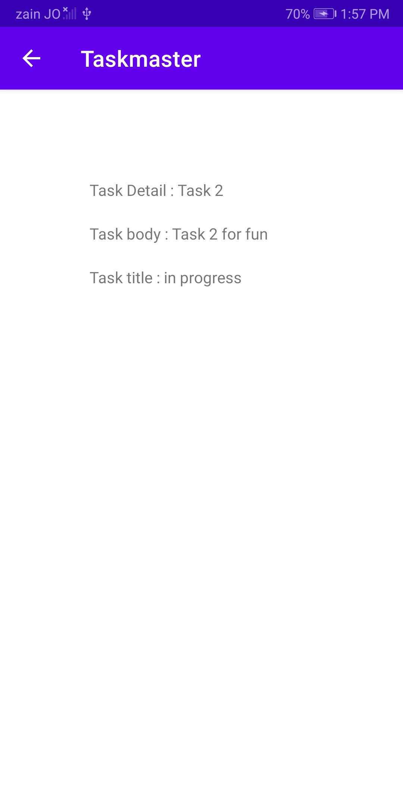
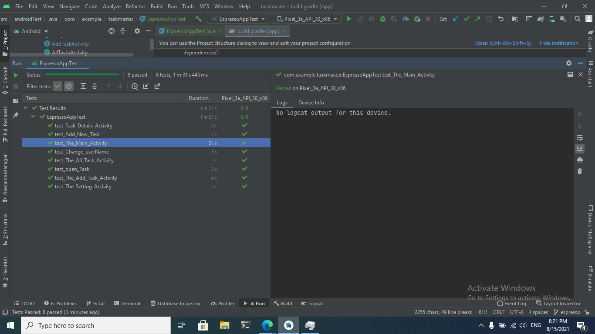

# Task Master

Teams may use this Android app to handle tasks. Adding, assigning, tracking, and deleting tasks are all part of this process.

***

Screen Shots

# Data-to-taskmaster lab-27

# Data-to-taskmaster lab-28

# Data-to-taskmaster lab-29 Room

# Data-to-taskmaster lab-31 Espresso test

# Data-to-taskmaster lab-32 Amplify AWS
 

# Data-to-taskmaster lab-33  Related Data

# Data-to-taskmaster Lab: 36 - Cognito

# Data-to-taskmaster Lab: 37 - S3

.png)

.png)

# Data-to-taskmaster Lab: 38 - Notification

.png)

# Data-to-taskmaster Lab: 39 - Review

.png)

.png)

# Data-to-taskmaster Lab: 41 - Intent Filters

.png)

.png)

.png)

.png)

.png)

# Data-to-taskmaster Lab: 42 - Location

.png)

.png)

.png)

.png)
