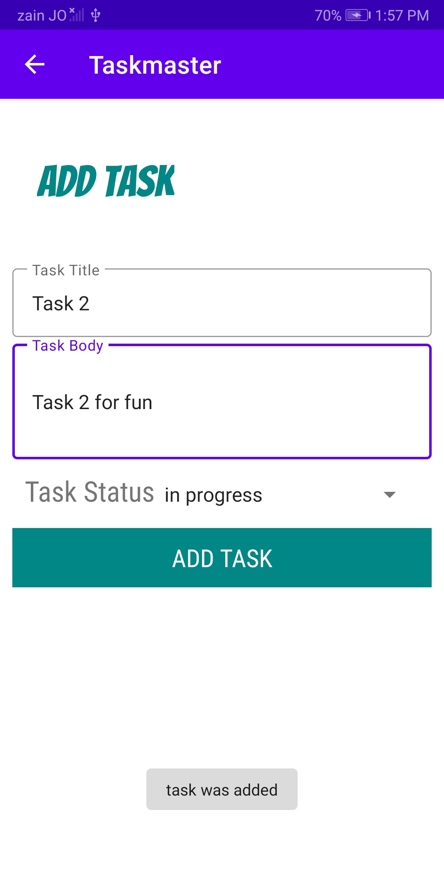

# Task Master

Teams may use this Android app to handle tasks. Adding, assigning, tracking, and deleting tasks are all part of this process.

***

Screen Shots

# Data-to-taskmaster lab-27

# Data-to-taskmaster lab-28

# Data-to-taskmaster lab-29 Room

# Data-to-taskmaster lab-31 Espresso test

